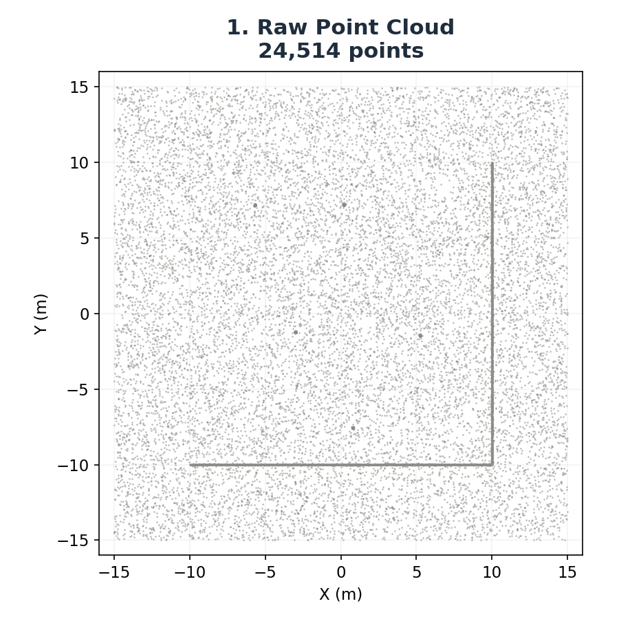
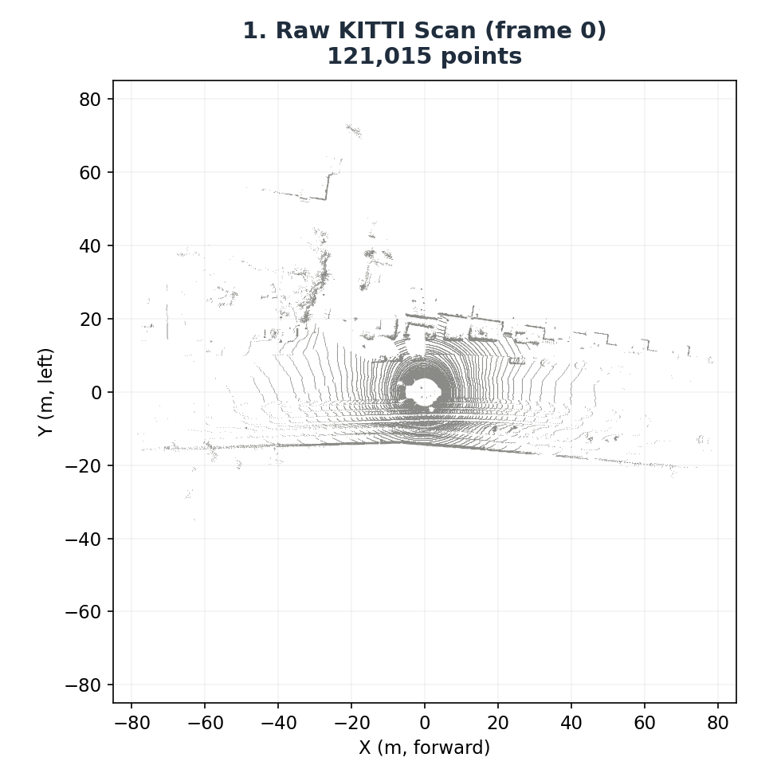
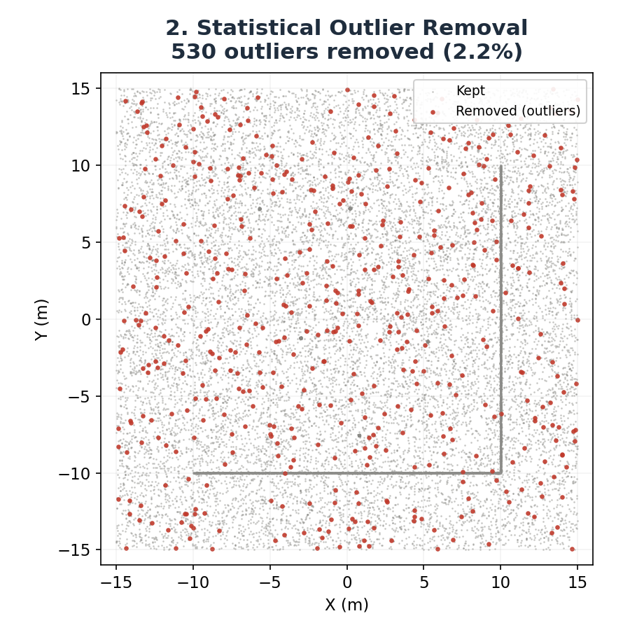
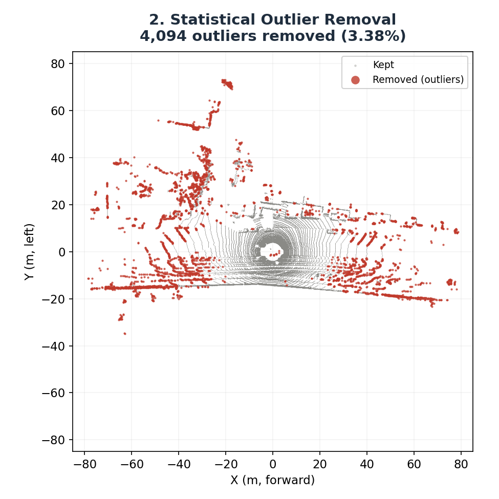
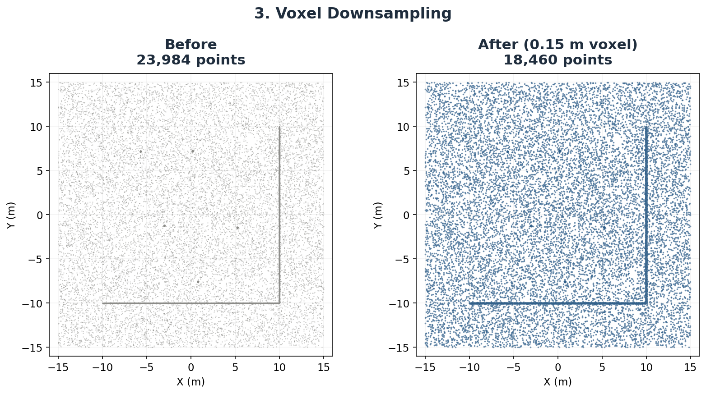
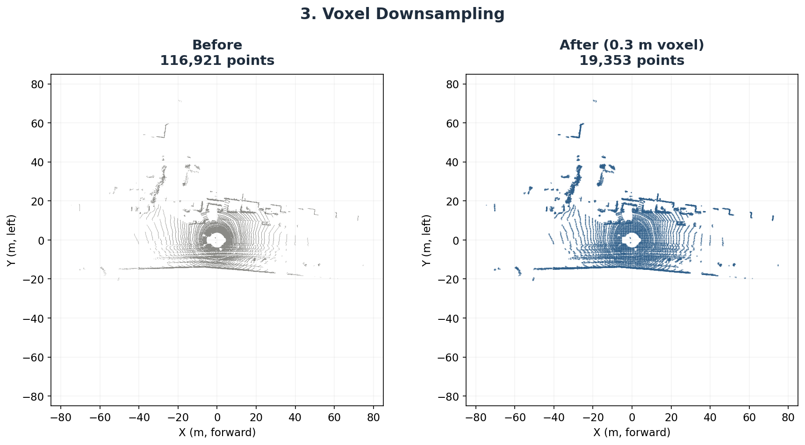
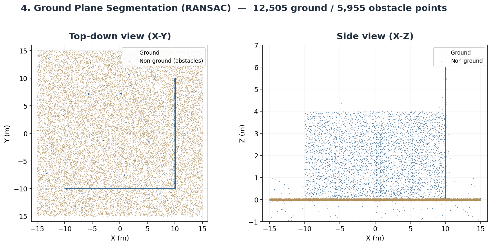
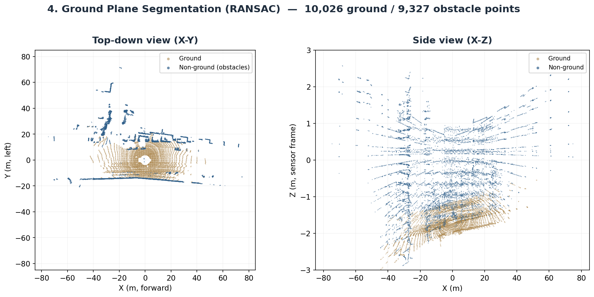
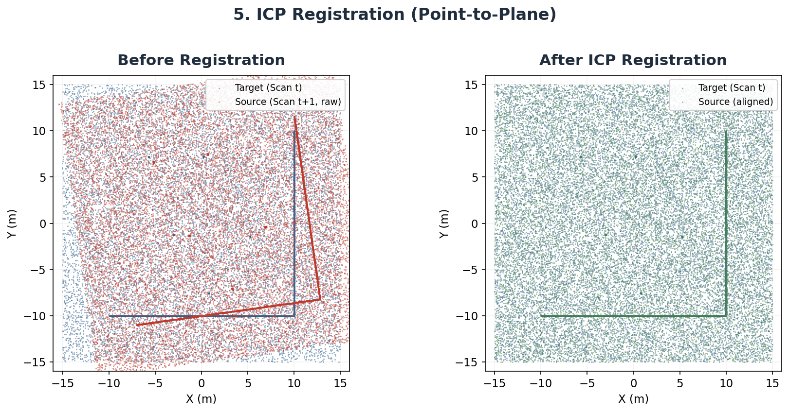
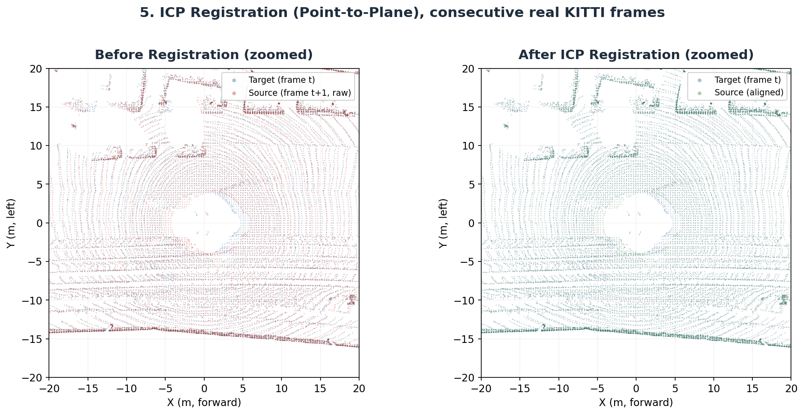

# LiDAR Point Cloud Preprocessing & ICP Registration

A practical, working implementation of the point-cloud preprocessing and scan-registration front end used by LiDAR-based localization and LiDAR–INS SLAM systems — built and validated on the [KITTI Odometry Dataset](https://www.cvlibs.net/datasets/kitti/eval_odometry.php).

> Developed during a summer internship at **Research Centre Imarat (RCI), DRDO**.


```text
Raw LiDAR Point Cloud
        ↓
Statistical Outlier Removal
        ↓
Voxel Downsampling
        ↓
Ground Plane Segmentation
        ↓
ICP Registration
        ↓
Registered Point Cloud
```

This isn't a full SLAM or LiDAR–INS navigation stack — it's a hands-on look at the preprocessing and registration stages that sit in front of one, with measured results rather than just a description of the theory.

---

## Table of Contents

- [Objectives](#objectives)
- [Dataset](#dataset)
- [Installation](#installation)
- [Usage](#usage)
- [Pipeline Stages](#pipeline-stages)
- [Results](#results)
- [Why Preprocessing Matters](#why-preprocessing-matters)
- [Relation to LiDAR–INS Navigation](#relation-to-lidar–ins-navigation)
- [Project Structure](#project-structure)
- [Future Extensions](#future-extensions)
- [References](#references)
- [Acknowledgments](#acknowledgments)

---

## Objectives

- Understand the structure and characteristics of raw 3D LiDAR point clouds.
- Investigate the effect of statistical outlier removal on noisy point-cloud data.
- Reduce point-cloud density using voxel downsampling while retaining important geometric information.
- Segment the ground plane to separate flat, redundant regions from structural points.
- Understand the working of ICP-based point-cloud registration.
- Analyze how preprocessing influences scan alignment quality and computational cost.
- Establish a practical foundation for more advanced LiDAR-based localization and LiDAR–INS integration.

---

## Dataset

This project uses the **[KITTI Odometry Dataset](https://www.cvlibs.net/datasets/kitti/eval_odometry.php)**, a widely used benchmark for autonomous driving, visual odometry, and LiDAR-based localization research. Scans are collected from a Velodyne HDL-64E mounted on a vehicle operating in real-world urban and road environments.

Each LiDAR point is stored as a 4-float record:

```text
[x, y, z, intensity]
```

| Field       | Description                                  |
|-------------|-----------------------------------------------|
| `x, y, z`   | 3D position of the measured point (meters)    |
| `intensity` | Strength of the returned laser signal          |

> **Note on data used for validation below:** the official Sequence 00 archive is hosted on KITTI's own servers (`cvlibs.net`). Where that wasn't reachable, real, unmodified KITTI raw-dataset frames (`2011_09_26_drive_0001_sync`) were used instead — genuine sensor data from the same vehicle/sensor platform, just a different drive. The code runs unchanged on the official Sequence 00 `.bin` files once downloaded.

---

## Installation

```bash
git clone <this-repo-url>
cd <this-repo>
pip install open3d numpy matplotlib
```

Then point the loader at your own KITTI `.bin` files (see [Usage](#usage)) or download Sequence 00 from the [official KITTI site](https://www.cvlibs.net/datasets/kitti/eval_odometry.php).

---

## Usage

```python
from lidar_pipeline import load_kitti_bin, run_pipeline

# Two consecutive scans: target (t) and source (t+1)
scan_t  = load_kitti_bin("dataset/sequences/00/velodyne/000000.bin")
scan_t1 = load_kitti_bin("dataset/sequences/00/velodyne/000001.bin")

results = run_pipeline(scan_t, scan_t1, voxel_size=0.3)

print(results["icp_result"].fitness, results["icp_result"].inlier_rmse)
```

Each stage function can also be called independently — see [`lidar_pipeline.py`](./lidar_pipeline.py):

```python
from lidar_pipeline import remove_outliers, voxel_downsample, segment_ground, register_icp
```

---

## Pipeline Stages

### 1. Raw Point Cloud
Loads raw LiDAR measurements into a 3D point cloud. A full 360° scan contains returns from road/ground surfaces, buildings, vehicles, poles, vegetation, and sensor noise — this is the starting point for everything downstream.

### 2. Statistical Outlier Removal
Isolated points that don't belong to any real structure (sensor noise, reflections, erroneous returns) are removed by comparing each point's neighborhood distance against the overall distribution.

```text
Raw Point Cloud → Neighbourhood Analysis → Identify Isolated Points → Remove Outliers → Filtered Point Cloud
```

### 3. Voxel Downsampling
The 3D space is divided into cubic voxels; all points inside a voxel collapse to one representative point (centroid). This trades geometric detail for a large cut in point count and nearest-neighbour search cost.

```text
Dense Point Cloud → Voxel Grid → Representative Points → Reduced Point Cloud
```

- **Smaller voxel** → more points, more detail, higher cost
- **Larger voxel** → fewer points, less detail, lower cost

### 4. Ground Plane Segmentation
The road/ground surface is usually flat, dominant, and geometrically repetitive — often less useful for registration than walls, poles, and corners. A RANSAC plane fit separates ground inliers from non-ground (structural) points.

```text
Point Cloud → Candidate Plane Estimation → Identify Plane Inliers → Ground Plane + Non-Ground Points
```

Ground removal is environment-dependent — in terrain with real elevation changes, the ground itself carries useful geometry and shouldn't be discarded automatically.

### 5. ICP Registration
[Iterative Closest Point](https://en.wikipedia.org/wiki/Iterative_closest_point) estimates the rigid transformation (rotation + translation) that aligns a source scan with a target scan:

```text
Source + Target → Initial Transform → Find Correspondences → Estimate R, t → Transform Source → Repeat Until Convergence
```

ICP's output is an estimate of the vehicle's relative motion between two LiDAR observations. Its quality depends on the initial transform, scan overlap, geometric structure, noise, and — critically — how well the scan was preprocessed.

---

## Results

The pipeline was validated in two passes: first on a controlled synthetic scene with known ground truth, then on real KITTI Velodyne data.

### Point Count per Stage

| Processing Stage              | Synthetic Scene | Real KITTI Scan |
|--------------------------------|----------------:|-----------------:|
| Raw Point Cloud                |          24,514 |          121,015 |
| After Statistical Outlier Removal |     23,984 (−2.16%) |    116,921 (−3.38%) |
| After Voxel Downsampling       |  18,460 (−23.0%) |   19,353 (−83.5%) |
| After Ground Segmentation      | 12,505 ground / 5,955 non-ground | 10,026 ground / 9,327 non-ground |

*(Voxel size: 0.15 m synthetic / 0.3 m KITTI — real KITTI scans are far denser, so a larger voxel was used.)*

### Registration Quality

| Metric                        | Synthetic Scene | Real KITTI Scan |
|--------------------------------|-----------------:|-----------------:|
| ICP Fitness                   |           0.9954 |           0.9779 |
| Inlier RMSE                   |          0.135 m |          0.211 m |
| Translation error vs. ground truth | 0.0012 m   |         — *(no ground truth; see sanity checks below)* |
| Estimated translation          |        1.5 m (known) |    1.350 m (recovered) |
| Total pipeline runtime         |                — |            710 ms |

**Sanity checks on real KITTI data** (no ground truth available, so validated independently):
- The fitted ground plane sits at `z ≈ −1.69 m`, matching KITTI's published **1.73 m** Velodyne mount height to within **2 cm**.
- The ICP-recovered 1.35 m frame-to-frame translation corresponds to **≈48 km/h** at KITTI's 10 Hz scan rate — consistent with real urban driving speed.

### Visual Comparison

**Raw point cloud** — synthetic scene (left) vs. real KITTI scan (right):

<p float="left">
  
  
</p>

**Statistical Outlier Removal** — removed points highlighted in red:

<p float="left">
  
  
</p>

**Voxel Downsampling** — before/after point density:

<p float="left">
  
  
</p>

**Ground Plane Segmentation** — ground (tan) vs. obstacles (blue):

<p float="left">
  
  
</p>

**ICP Registration** — before vs. after alignment:

<p float="left">
  
  
</p>

*(Left column: controlled synthetic scene. Right column: real KITTI Velodyne data. Full-size images in [`/figures`](./figures).)*

---

## Why Preprocessing Matters

```text
Noise → Poor Correspondences → Poor Registration
Too Many Points → Higher Computational Cost → Slower Registration
```

The goal of preprocessing isn't to shrink the point cloud for its own sake — it's to keep the geometric information that registration actually needs while discarding noise and redundancy that only slow it down or mislead it.

---

## Relation to LiDAR–INS Navigation

This project implements the **point-cloud processing and registration front end** of a larger LiDAR-based localization pipeline:

```text
                 IMU
                  ↓
           State Prediction
                  ↓
LiDAR → Point Cloud Processing
                  ↓
           Feature Extraction
                  ↓
           Scan Registration
                  ↓
       LiDAR-Based Measurement
                  ↓
          Sensor Fusion
                  ↓
          Updated State
```

The IMU provides high-rate motion data but drifts over time; LiDAR provides geometric observations that constrain that drift. Tightly-coupled LiDAR–INS estimators (e.g., LINS) integrate both directly into a single state-estimation framework — this project stops short of that, focusing on getting the LiDAR-side preprocessing and registration right first.

---

## Project Structure

```text
.
├── lidar_pipeline.py           # Core pipeline: load, SOR, voxel, ground seg, ICP
├── figures/
│   ├── synthetic/               # Stage-by-stage visuals, controlled synthetic scene
│   └── kitti/                   # Stage-by-stage visuals, real KITTI Velodyne data
├── results/
│   ├── synthetic_results.json   # Point counts, ICP fitness/RMSE (synthetic)
│   └── kitti_results.json       # Point counts, ICP fitness/RMSE, runtime (KITTI)
└── README.md
```

---

## Technologies Used

| Tool | Role |
|---|---|
| **Python** | Core implementation language |
| **Open3D** | Point cloud I/O, filtering, RANSAC segmentation, ICP |
| **NumPy** | Numerical processing, synthetic data generation |
| **Matplotlib** | Stage-by-stage visualization |
| **KITTI Odometry Dataset** | Real-world LiDAR data source |

---

## Future Extensions

- [ ] Point-to-plane and Generalized ICP (GICP)
- [ ] Normal Distributions Transform (NDT)
- [ ] LiDAR feature extraction (edges / planes, LOAM-style)
- [ ] IMU-based motion prediction
- [ ] LiDAR–IMU tightly-coupled sensor fusion
- [ ] Loop-closure detection (e.g., Scan Context)
- [ ] Pose-graph optimization
- [ ] Full LiDAR–INS SLAM stack

---

## References

- Geiger, A., Lenz, P., and Urtasun, R., *Are We Ready for Autonomous Driving? The KITTI Vision Benchmark Suite*, CVPR, 2012.
- Besl, P. J. and McKay, N. D., *A Method for Registration of 3-D Shapes*, IEEE Transactions on Pattern Analysis and Machine Intelligence, 1992.
- Segal, A., Haehnel, D., and Thrun, S., *Generalized-ICP*, Robotics: Science and Systems, 2009.
- Qin, T., Cao, S., Pan, J., and Shen, S., *LINS: A Tightly-Coupled LiDAR-Inertial State Estimator for Mobile Robots*, IEEE ICRA, 2019.

---

## Project Context

Undertaken as a practical exploration of LiDAR-based localization during a **summer internship at Research Centre Imarat (RCI), DRDO**, as part of a broader study on **LiDAR and Inertial Navigation System (INS) integration for GNSS-denied navigation**. The focus here is the transition from raw LiDAR measurements to geometric constraints — the piece that ultimately feeds into a full navigation and state-estimation framework.

## Acknowledgments

This work was carried out as part of a summer internship at **Research Centre Imarat (RCI), Defence Research and Development Organisation (DRDO)**.
